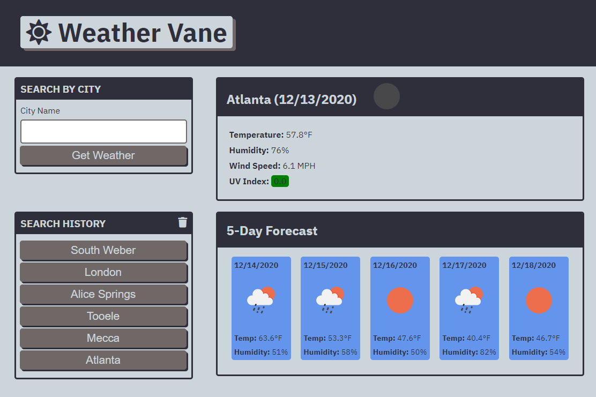

# Weather-Vane
Week 6: Server-Side API's Challenge 

## Description

This site was designed to enhance my skills using Server-Side APIs.

## Built With
* HTML
* CSS
* OpenWeather API

## Site Location
[Weather Vane](https://russtracy.github.io/Weather-Vane/)

## Contribution
Made by [Russ Tracy]

## Site Image

### ©️2020 Russ Tracy
